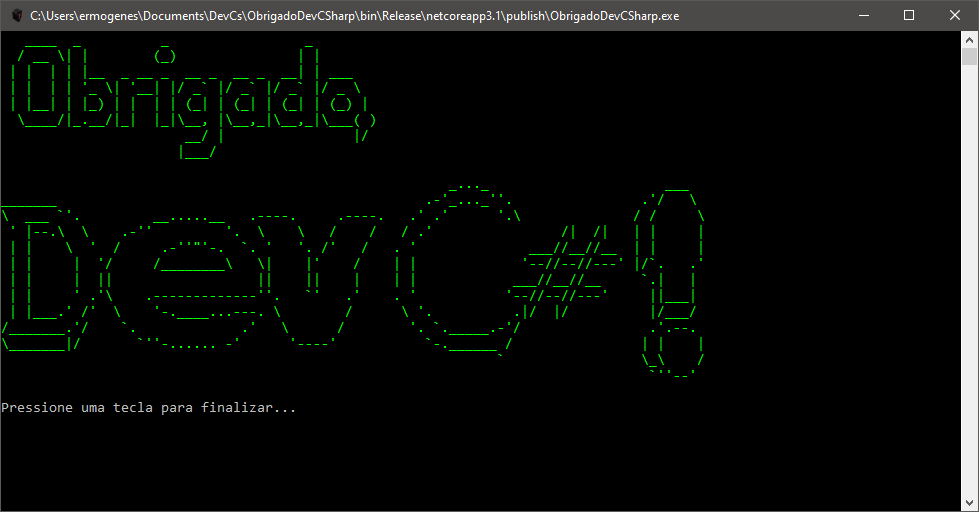

# ObrigadoDevCSharp

Este software exibe na tela do usuário um agradecimento ao programa Dev C#.

## Exemplo

```
   ____  _          _                 _        
  / __ \| |        (_)               | |       
 | |  | | |__  _ __ _  __ _  __ _  __| | ___   
 | |  | | '_ \| '__| |/ _` |/ _` |/ _` |/ _ \  
 | |__| | |_) | |  | | (_| | (_| | (_| | (_) | 
  \____/|_.__/|_|  |_|\__, |\__,_|\__,_|\___( )
                       __/ |                |/ 
                      |___/

                                                        _..._                      ___   
_______                                              .-'_..._''.                .'/   \  
\  ___ `'.         __.....__   .----.     .----.   .' .'      '.\              / /     \ 
 ' |--.\  \    .-''         '.  \    \   /    /   / .'                /|  /|   | |     | 
 | |    \  '  /     .-''"'-.  `. '   '. /'   /   . '              ___//__//__  | |     | 
 | |     |  '/     /________\   \|    |'    /    | |             '--//--//---' |/`.   .' 
 | |     |  ||                  ||    ||    |    | |            ___//__//__     `.|   |  
 | |     ' .'\    .-------------''.   `'   .'    . '           '--//--//---'     ||___|  
 | |___.' /'  \    '-.____...---. \        /      \ '.          .|/  |/          |/___/
/_______.'/    `.             .'   \      /        '. `._____.-'/                .'.--.
\_______|/       `''-...... -'      '----'           `-.______ /                | |    |
                                                              `                 \_\    /
                                                                                 `''--'

Pressione uma tecla para finalizar...
```

## _Screenshot_



## _Download_

Baixe o arquivo abaixo. Descompacte na pasta desejada.

[🗃 Download do arquivo .zip](dist/ObrigadoDevCSharp.zip)

Execute utilizando o comando:

```
dotnet ObrigadoDevCSharp.dll
```

Ou, se você estiver no Windows, pode dar um duplo-clique no ícone do programa.

## Agradecimentos

- [Figgle](https://github.com/drewnoakes/figgle)
- [Etec Adolpho Berezin](http://eteab.com.br/)
- [Prof. Ermogenes](https://github.com/ermogenes)
- [Dev C#](https://github.com/ermogenes/aulas-programacao-csharp)

---

Todos os direitos reservados. PIRATARIA É CRIME.

